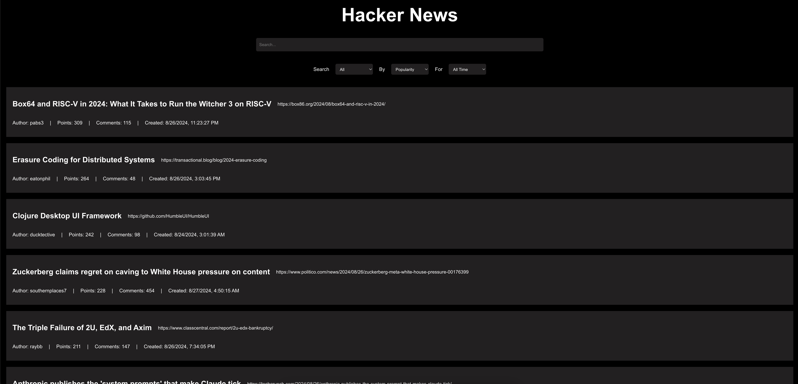

# Hacker News Clone
Get started

To get started, follow these steps:

1. Install dependencies by running the command `npm i`.

2. Run the application by executing `npm start`.

That's it! You're all set to start using the application.

